

# Dev_Setup
Setup Development Environment

#Assignment: Setting Up Your Developer Environment

#Objective:
This assignment aims to familiarize you with the tools and configurations necessary to set up an efficient developer environment for software engineering projects. Completing this assignment will give you the skills required to set up a robust and productive workspace conducive to coding, debugging, version control, and collaboration.

#Tasks:

1. Select Your Operating System (OS):
   Choose an operating system that best suits your preferences and project requirements. Download and Install Windows 11. https://www.microsoft.com/software-download/windows11
Check System Requirements
Ensure your PC meets the minimum system requirements for Windows 11 for example a processor  1 GHz or faster with 2 or more cores on a compatible 64-bit processor .
Internet connectivity is necessary to perform updates and to download and take advantage of some features.
Back up important files and data to an external drive or cloud storage to prevent data loss.
To download Windows visit the official microsoft account and download https://www.microsoft.com/software-download/windows11
Create a Bootable USB Drive
From the same download page, click Download Now under the "Create Windows 11 Installation Media" section.
Open the Media Creation Tool and follow the instructions.
Select USB flash drive and choose your USB drive to create the bootable media.
After setting up plug in the USB drive with Windows 11 installation media.
Restart your computer and boot from the USB drive (change the boot order in the BIOS/UEFI settings).
Follow the on-screen prompts to install Windows 11.
Choose Installation Type and continue with the installation
Select the partition where you want to install Windows 11 or create a new partition.
Continue following the on-screen instructions to complete the installation.
Set Up Windows 11
Select your language, time, and keyboard preferences
Connect to a Wi-Fi network or plug in an Ethernet cable.
Sign in with a Microsoft account or create a local account.
Choose your privacy settings and other preferences.
Install updates add drivers required for smooth running of the new windows installed. 
Install the required software and apps to be used . 
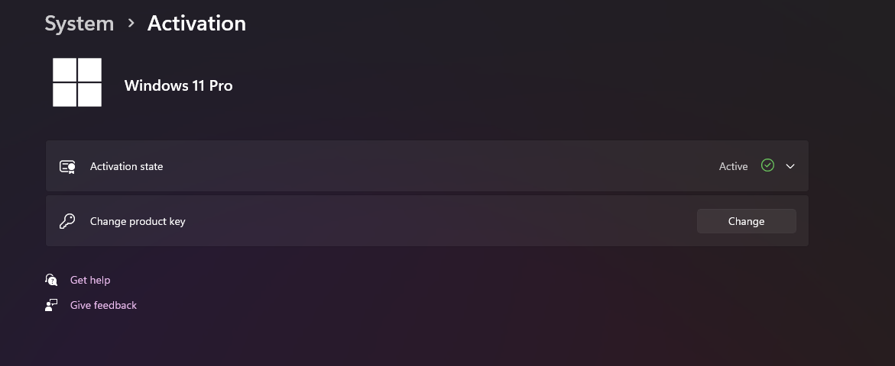

2. Install a Text Editor or Integrated Development Environment (IDE):
   Select and install a text editor or IDE suitable for your programming languages and workflow. Download and Install Visual Studio Code. https://code.visualstudio.com/Download
Visit the official Visual Studio Code website (https://code.visualstudio.com/) using your web browser of choice.
Click on the "Download for Windows" button to download the installer file.
Once the download is complete, locate the downloaded installer file and run it by double clicking.
Follow the prompts in the installation wizard. Choose the installationlocation and whether to add VS Code to your PATH (environment variables) during the installation process.
After the installation is complete launch Visual Studio Code by searching for "Visual Studio Code" in the Start menu or on the shortcut icon on the desktop.
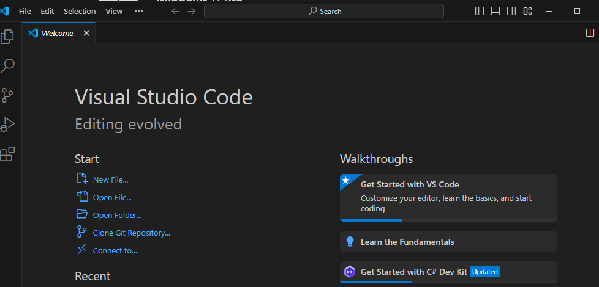
3. Set Up Version Control System:
   Install Git and configure it on your local machine. Create a GitHub account for hosting your repositories. Initialize a Git repository for your project and make your first commit. https://github.com
Go to the Git for Windows download page and download the installer.
Open the downloaded .exe file and follow the installation prompts. You can generally accept the default settings , changes can be done later after installation.
Open Command Prompt (cmd) and type ; git --version  to verify installation and you should see the version number of Git.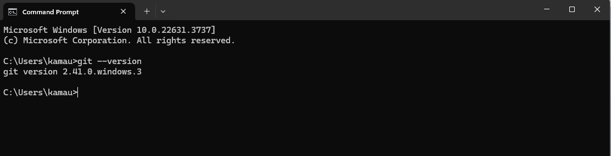
In your terminal, to set your username type;
git config --global user.name "Your Name"
In your terminal, to set your email  type;
git config --global user.email "your.email@example.com"
To confirm your settings, type;
git config --list
Go to GitHub and sign up for an account .
Verify your email address by clicking the verification link sent to your email.
Go to create a repository on GitHub you want to create and clone .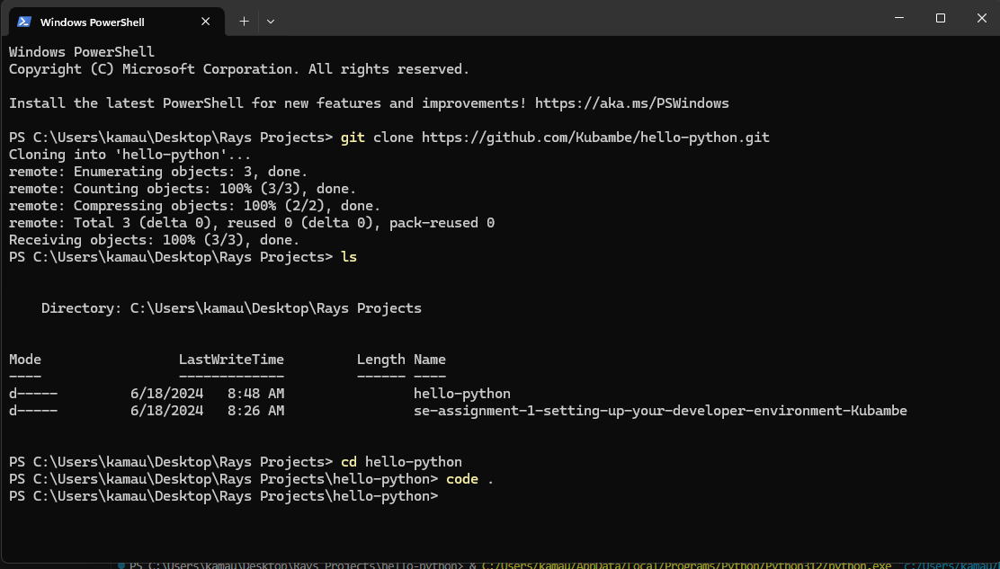
Click the green Code button and copy the SSH URL.
Clone the Repository make the necessary changes and commit
 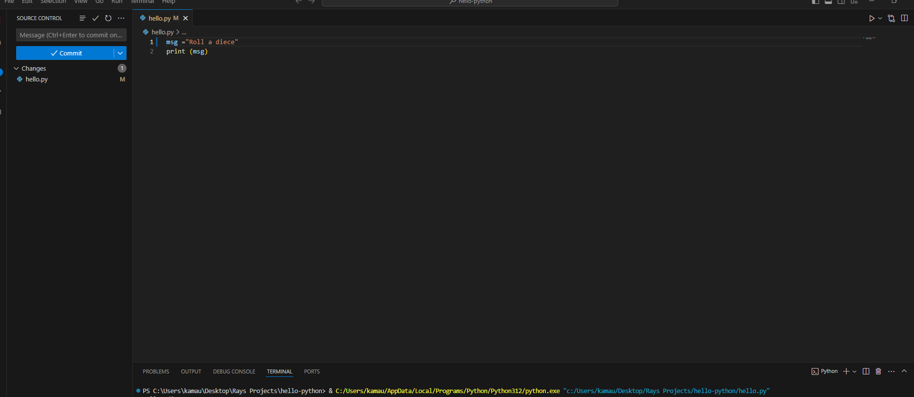
https://github.com/Kubambe/hello-python.git

4. Install Necessary Programming Languages and Runtimes:
  Install Python from http://wwww.python.org programming language required for your project and install their respective compilers, interpreters, or runtimes. Ensure you have the necessary tools to build and execute your code.
Go to the official Python website http://wwww.python.org
Navigate to the "Downloads" section and click on the download link to get the latest stable version of Python.
Locate the downloaded .exe file and double-click it to run the installer.
Add Python to PATH: On the first screen, check the box that says "Add Python to PATH". This makes it easier to run Python from the command line and click "Install Now" to proceed with the installation.
Wait for the installation to complete, then click "Close". To ensure that Python has been installed correctly:
Open Command Prompt and type py --version
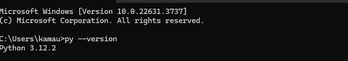
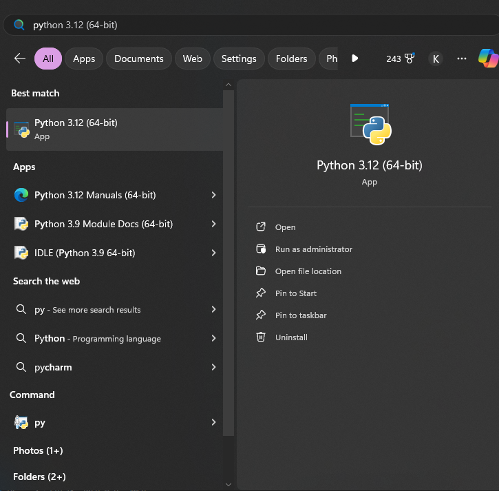

5. Install Package Managers:
   If applicable, install package managers like pip (Python).
Download the get-pip.py script from https://pypi.org/project/pip/
Run the script:python get-pip.py
check and verify if installed by typing ;pip --version 
Another one way to ens0ure pip is installed is to :
Open VS Code.
Go to Extensions: Click on the Extensions view icon on the Sidebar (or press Ctrl+Shift+X).
Search for Python: In the Extensions view search bar, type Python and select the one published by Microsoft.
Install the Extension: Click the Install button.Open a Project or Create a New Folder: You can open an existing Python project or create a new folder for your project.
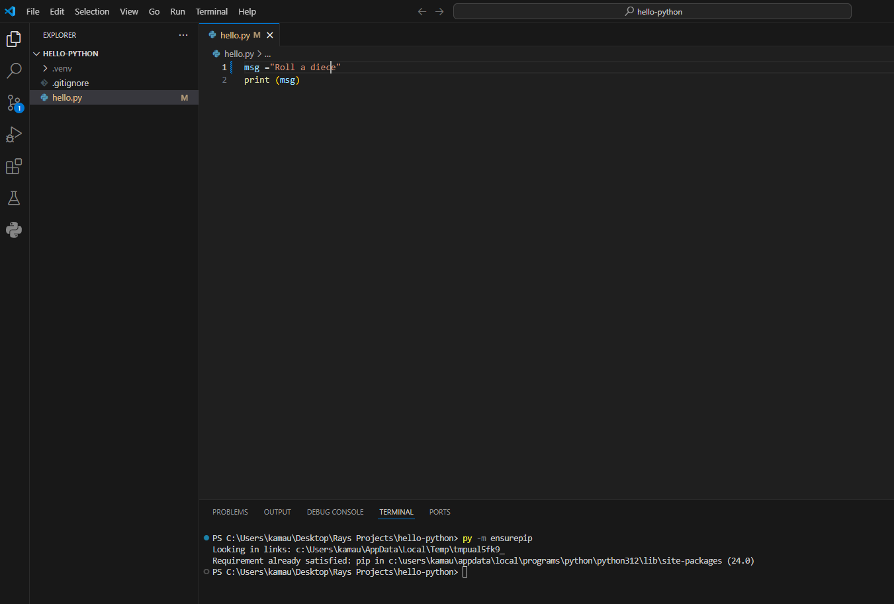
6. Configure a Database (MySQL):
   Download and install MySQL database. https://dev.mysql.com/downloads/windows/installer/5.7.html
Go to the official MySQL website (https://www.mysql.com/).
Choose the appropriate version for your operating system.
Click on the download link for the MySQL installer .
Locate the downloaded .msi file and double-click it to run the installer.
Select the setup type (Developer Default, Server Only, etc.). For most users, "Developer Default" is recommended.
The installer will check for required software. If something is missing, it will prompt you to install it.
Use the default installation path or specify a custom path.
Apply Configuration by following the prompts to configure MySQL.
Choose the configuration type (Standalone, InnoDB Cluster, etc.), select the port number (default is 3306), and configure the root password.
Check the box to run MySQL as a Windows service and choose whether it should start automatically.
Click "Execute" to apply the configuration and complete the installation
log into MySQL:
mysql -u root -p
and enter the root password you configured during installation
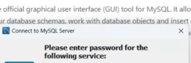 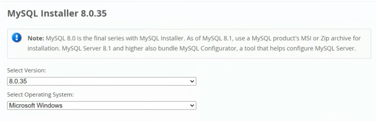 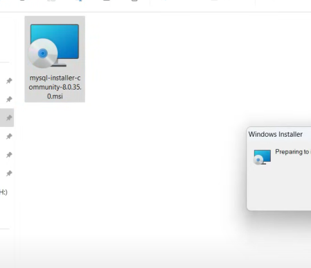 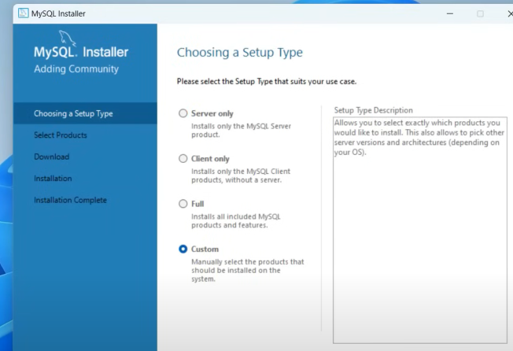 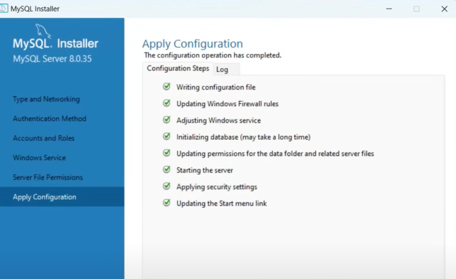 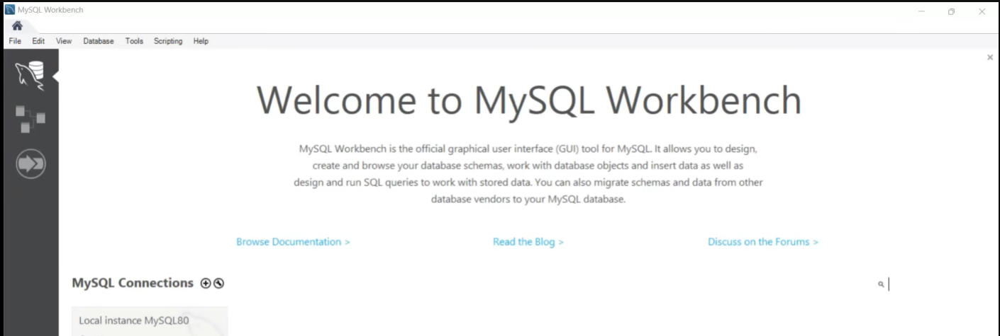

7. Set Up Development Environments and Virtualization (Optional):
   Consider using virtualization tools like Docker or virtual machines to isolate project dependencies and ensure consistent environments across different machines.
Go to  https://docs.docker.com/desktop/install/windows-install/ and install docker desktop for windows.
Run the installer and follow the installation wizard steps. After the installation, Docker Desktop will start automatically. 
To verify the installation open Command Prompt or PowerShell and run the following command to check the Docker version 
docker --version
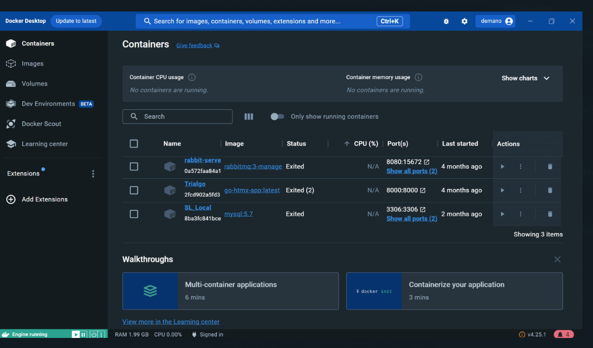
8. Explore Extensions and Plugins:
   Explore available extensions, plugins, and add-ons for your chosen text editor or IDE to enhance functionality, such as syntax highlighting, linting, code formatting, and version control integration.
VS Code has different plugins and extensions and here are some for python;
For highlighting theres is magic python
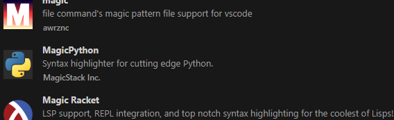
Pylint- Linting for Python using Pylint 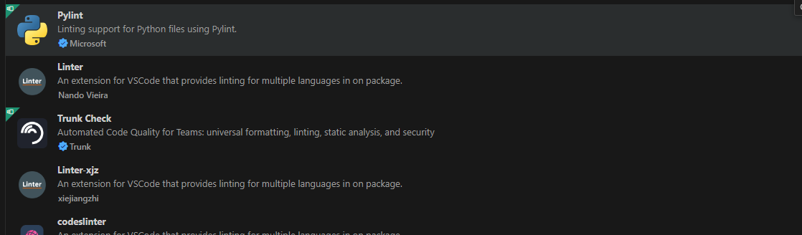
autopep8- Formats Python code to conform to the PEP 8 style guide	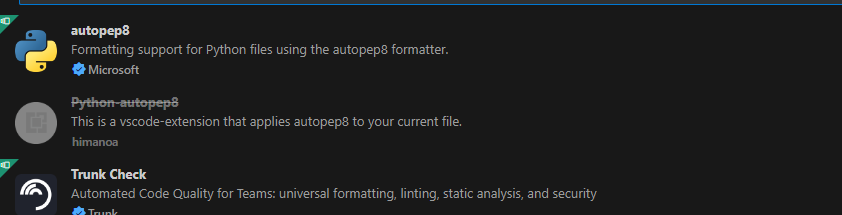
Black- A popular Python code formatter 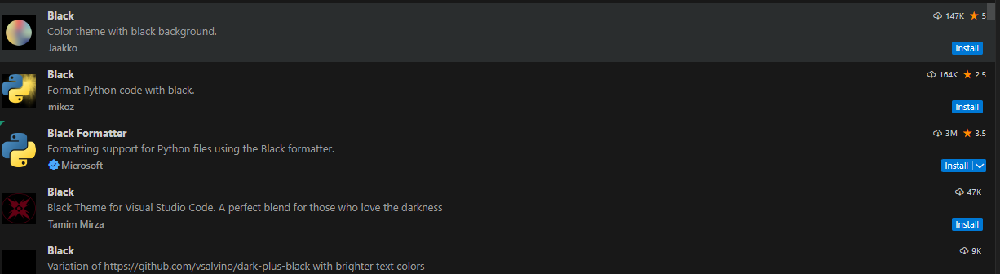
Git History- Provides a visual representation of Git history 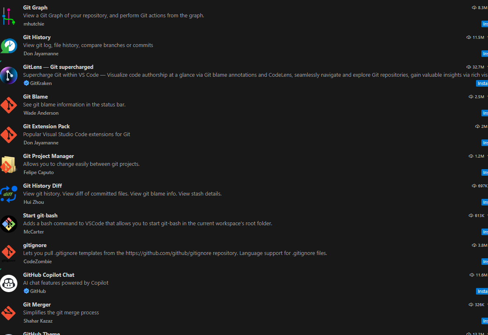
GitLens- Supercharges the built-in Git capabilities in VS Code
Python Environment Manager: Manages Python environments within VS Code 
By using these extensions, plugins, and add-ons, you can significantly enhance the functionality of your text editor or IDE, making your development workflow more efficient and productive.
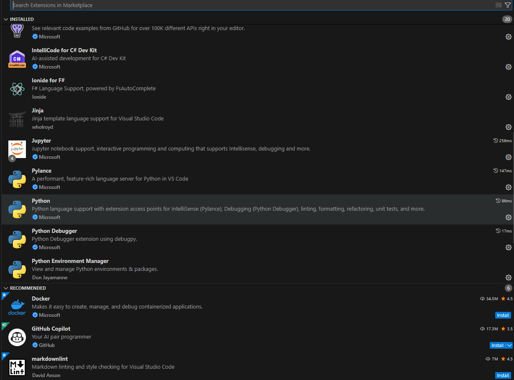
9. Document Your Setup:
    Create a comprehensive document outlining the steps you've taken to set up your developer environment. Include any configurations, customizations, or troubleshooting steps encountered during the process. 
After installing and settig up the different required environments some of the troubleshooting steps we should takeare;
Incase installation fails ensure you have administrative privileges. Run the installer as an administrator. 
Check if your antivirus or firewall is blocking the installation.
incase downloads fail make sure you have an active internet connection. Check the output panel in VS Code for specific error message.
Check compatibility of the downloads you want to include
Many programs and Windows itself provide log files that can offer clues about what’s going wrong.
Often, the specific error message or behavior has been encountered by others, and solutions can be found on forums or official support sites.
Sometimes, simply uninstalling and reinstalling the program can fix issues.

#Deliverables:
- Document detailing the setup process with step-by-step instructions and screenshots where necessary.
- A GitHub repository containing a sample project initialized with Git and any necessary configuration files (e.g., .gitignore).
- A reflection on the challenges faced during setup and strategies employed to overcome them.

#Submission:
Submit your document and GitHub repository link through the designated platform or email to the instructor by the specified deadline.

#Evaluation Criteria:**
- Completeness and accuracy of setup documentation.
- Effectiveness of version control implementation.
- Appropriateness of tools selected for the project requirements.
- Clarity of reflection on challenges and solutions encountered.
- Adherence to submission guidelines and deadlines.

Note: Feel free to reach out for clarification or assistance with any aspect of the assignment.
